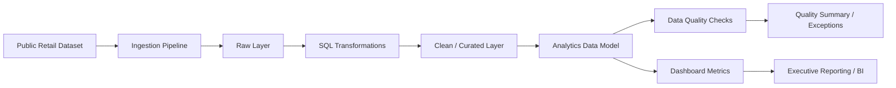
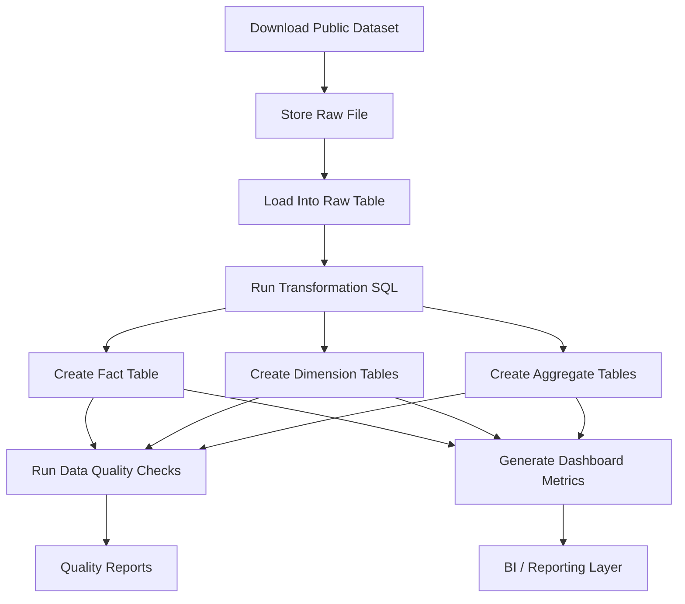

# Data Pipeline Diagram

## Overview

This document describes the end-to-end data pipeline for the **Data Platform Foundations** project.

The pipeline is designed to simulate a modern analytics workflow using a layered architecture:

- Source ingestion
- Raw data storage
- SQL-based transformation
- Analytics-ready data modeling
- Data quality validation
- Dashboard metric consumption

---

## High-Level Pipeline Flow

---

## Pipeline Stages

### 1. Public Dataset

The source data is a publicly available retail transactions dataset.

Purpose:
- simulate an enterprise source extract
- provide realistic transaction-level records
- support reporting and analytics workflows

---

### 2. Ingestion Pipeline

The ingestion pipeline loads the source file into the raw layer.

Key responsibilities:
- load source file from `/data/raw`
- preserve source fidelity
- capture ingestion metadata
- validate source row counts
- standardize initial column naming conventions

Example outputs:
- raw transaction table
- ingestion log
- batch metadata

---

### 3. Raw Layer

The raw layer stores source-aligned data with minimal transformation.

Characteristics:
- closest representation of source data
- used for traceability and reconciliation
- preserves original columns and values
- supports auditability

Example table:
- `raw.online_retail_transactions`

---

### 4. SQL Transformations

The transformation layer applies business and technical logic to prepare data for analytics use.

Key responsibilities:
- cast data types
- standardize date fields
- calculate sales amount
- identify returns / cancellations
- handle missing or invalid values
- create curated analytics tables

Example outputs:
- cleaned transactions
- customer-level rollups
- product-level summaries
- monthly sales summaries

---

### 5. Clean / Curated Layer

This layer contains standardized, validated datasets ready for downstream modeling.

Characteristics:
- improved query usability
- more consistent business logic
- easier downstream reporting
- better quality control

Example table:
- `clean.transactions`

---

### 6. Analytics Data Model

The analytics layer organizes curated data into reusable reporting structures.

Typical model:
- fact table for transactions
- dimensions for customer, product, and date
- aggregate summaries for dashboards

Example tables:
- `analytics.fact_sales_transactions`
- `analytics.dim_customer`
- `analytics.dim_product`
- `analytics.dim_date`
- `analytics.monthly_sales_summary`

---

### 7. Data Quality Checks

Quality validation is applied to ensure trust in analytics outputs.

Checks include:
- null checks
- duplicate detection
- invalid quantity checks
- invalid price checks
- reconciliation checks
- schema conformance

Example outputs:
- validation log
- failed record table
- summary of exceptions

---

### 8. Dashboard Metrics

The final consumption layer exposes business-facing KPIs.

Example metrics:
- total revenue
- net revenue
- total orders
- average order value
- active customers
- top products
- sales by country
- return rate
- data quality issue count

These metrics can feed:
- Power BI
- Tableau
- Streamlit
- notebook-based reporting

---

## Detailed Flow

---

## Engineering Design Notes

### Layered Architecture
The pipeline is intentionally separated into layers to improve:
- maintainability
- auditability
- testability
- readability

### SQL-First Transformation Strategy
SQL is used for transformation logic because it is:
- transparent
- reviewable
- easy to validate
- standard in analytics engineering workflows

### Embedded Data Quality
Quality checks are included as part of the pipeline rather than treated as an afterthought.

### Reusable Analytics Outputs
The pipeline is designed so the same transformed tables can support:
- dashboards
- ad hoc analysis
- machine learning feature generation
- stakeholder reporting

---

## Suggested Supporting Files

This diagram aligns with the following project files:

- `README.md`
- `dataset.md`
- `architecture.md`
- `data-model.md`
- `pipeline/`
- `analytics/`
- `quality/`
- `results/`

---

## Summary

This pipeline demonstrates a production-minded analytics workflow where public source data is ingested, transformed, validated, and surfaced as trusted business metrics.

The design emphasizes both technical reliability and business usability.
