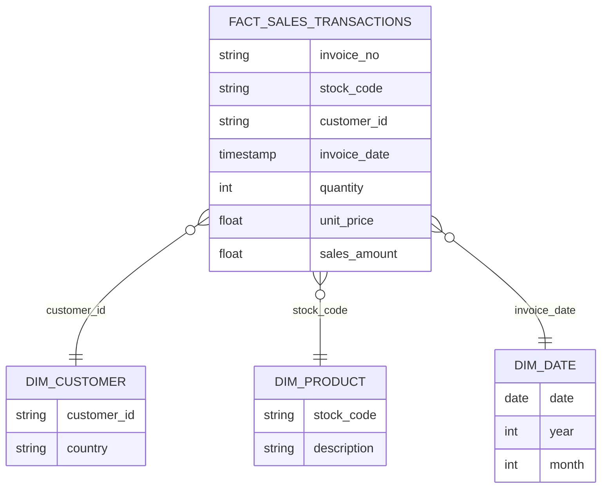

# Data Model

## Overview

The analytics layer for this project follows a simplified **star schema** design.

The objective of the data model is to provide:

- consistent business definitions
- performant analytics queries
- reusable reporting tables
- simplified dashboard consumption

The model separates **facts (transactions)** from **dimensions (descriptive attributes)** to support scalable analytics workloads.

---

# Star Schema Design

The model consists of:

Fact Tables  
Dimension Tables  
Aggregate Tables

Dimension Tables
│
▼
Fact Sales Transactions
│
▼
Aggregate Reporting Tables


---

# Fact Table

## fact_sales_transactions

This is the central transactional table representing individual retail sales events.

Each record represents a line item within a sales invoice.

### Key Columns

| Column | Description |
|------|-------------|
| invoice_no | transaction identifier |
| stock_code | product identifier |
| customer_id | customer identifier |
| invoice_date | timestamp of purchase |
| quantity | units purchased |
| unit_price | price per unit |
| sales_amount | quantity × unit price |
| country | customer country |

### Purpose

This table supports:

- transaction-level analytics
- product demand analysis
- customer behavior analysis
- revenue calculations

---

# Dimension Tables

Dimension tables provide descriptive context for fact records.

---

## dim_customer

Contains customer-level attributes.

| Column | Description |
|------|-------------|
| customer_id | unique customer identifier |
| country | geographic region |
| first_purchase_date | first recorded transaction |
| customer_segment | derived segmentation group |

Purpose:

- customer analytics
- cohort analysis
- customer lifetime value analysis

---

## dim_product

Contains product-level attributes.

| Column | Description |
|------|-------------|
| stock_code | product identifier |
| description | product description |

Purpose:

- product performance analysis
- inventory trend analysis

---

## dim_date

Calendar dimension supporting time-based analysis.

| Column | Description |
|------|-------------|
| date | calendar date |
| year | year value |
| month | month value |
| quarter | quarter value |
| day_of_week | weekday name |

Purpose:

- time-series analytics
- trend analysis
- period comparisons

---

# Aggregate Tables

Aggregate tables provide precomputed analytics metrics for dashboards.

---

## monthly_sales_summary

Contains revenue and order metrics aggregated by month.

| Column | Description |
|------|-------------|
| year_month | reporting period |
| total_orders | count of orders |
| total_units_sold | units sold |
| total_revenue | revenue generated |
| avg_order_value | average transaction value |

Purpose:

- executive reporting
- dashboard visualizations
- trend analysis

---

## country_sales_summary

Contains aggregated metrics by geographic region.

| Column | Description |
|------|-------------|
| country | country name |
| total_revenue | revenue generated |
| total_orders | number of orders |

Purpose:

- geographic sales analysis
- regional performance comparison

---

# Data Model Relationships
dim_customer.customer_id
│
▼
fact_sales_transactions.customer_id

dim_product.stock_code
│
▼
fact_sales_transactions.stock_code

dim_date.date
│
▼
fact_sales_transactions.invoice_date

## Data Model Diagram



---

# Design Principles

The data model follows several principles commonly used in modern analytics platforms.

### Separation of Concerns

Raw transactional data is separated from analytics-ready tables.

### Consistent Business Metrics

Derived fields such as `sales_amount` are standardized to ensure consistency across dashboards.

### Query Performance

Fact and dimension separation improves query performance and simplifies joins.

### Analytics Readability

Tables are structured to support intuitive queries for analysts and BI tools.

---

# Example Analytics Queries

Example: Monthly Revenue

```sql
SELECT
    DATE_TRUNC('month', invoice_date) AS month,
    SUM(sales_amount) AS total_revenue
FROM analytics.fact_sales_transactions
GROUP BY 1
ORDER BY 1;

Example: Top Products by Revenue
SELECT
    p.description,
    SUM(f.sales_amount) AS total_revenue
FROM analytics.fact_sales_transactions f
JOIN analytics.dim_product p
    ON f.stock_code = p.stock_code
GROUP BY p.description
ORDER BY total_revenue DESC
LIMIT 10;
