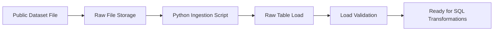

---
# Data Pipeline README

Contains ingestion and transformation code used to move data
through the analytics platform.
---

## Overview

This directory contains the ingestion and raw-load components for the **Data Platform Foundations** project.

The pipeline is responsible for moving publicly available source data into a raw analytics environment where it can be validated, transformed, and modeled for downstream reporting.

This layer is intentionally designed to reflect a production-minded ingestion workflow.

---

## Pipeline Responsibilities

The ingestion pipeline performs the following functions:

- acquires the public source dataset
- stores raw files in a source-aligned format
- loads records into a raw table
- captures ingestion metadata
- validates source-to-load row counts
- prepares the raw layer for downstream SQL transformations

---

## Source Dataset

This project uses a public retail transactions dataset.

Example source characteristics:
- transactional sales data
- product, customer, date, quantity, and pricing fields
- enough volume to simulate realistic analytics workflows

The source file should be stored in a raw input location such as:

```text
data/raw/online_retail.csv
```

---

## Pipeline Flow



---

## Expected Inputs

Typical input file:
- CSV or Excel retail transaction extract

Required source fields:
- InvoiceNo
- StockCode
- Description
- Quantity
- InvoiceDate
- UnitPrice
- CustomerID
- Country

---

## Expected Outputs

The pipeline should produce:

### 1. Raw File Storage
A copy of the original dataset stored in a raw landing location.

### 2. Raw Table
A source-aligned raw table such as:

```text
raw.online_retail_transactions
```

### 3. Ingestion Metadata
Metadata captured during the load process, such as:
- load timestamp
- source file name
- batch id
- record count
- load status

### 4. Validation Results
Basic validation checks confirming:
- row counts loaded successfully
- required columns are present
- timestamp field is parseable
- file was read successfully

---

## Suggested Directory Contents

This folder may eventually contain:

```text
pipeline/
  README.md
  ingestion.py
  load_raw.sql
  config.yaml
  logging_config.py
```

---

## Ingestion Design Principles

### Preserve Source Fidelity
Raw data should remain as close to the source as possible.

### Separate Raw from Curated
No business logic should be embedded in the raw load beyond basic structural standardization.

### Capture Metadata
Every load should include enough metadata to support traceability and troubleshooting.

### Validate Early
Basic ingestion validation should happen before transformation logic begins.

---

## Example Ingestion Steps

1. Download the public source dataset
2. Save the file to the raw input location
3. Read the file using Python
4. Standardize column names if needed
5. Load data into the raw table
6. Capture ingestion metadata
7. Run row count and schema validation checks
8. Hand off to the SQL transformation layer

---

## Example Validation Checks

The ingestion pipeline should validate:

- file exists
- expected columns are present
- row count is greater than zero
- date column can be parsed
- no critical load failure occurred

Example checks:

```text
Check 1: Source file found
Check 2: Required columns present
Check 3: Loaded row count > 0
Check 4: InvoiceDate parse success
Check 5: Raw table created successfully
```

---

## Downstream Dependencies

The following downstream components depend on this pipeline:

- `analytics/`
- `quality/`
- `results/`

If ingestion fails or the raw table is incomplete, all downstream reporting and analytics outputs are impacted.

---

## Failure Modes to Consider

Common ingestion risks include:

- missing source file
- malformed date values
- missing required columns
- duplicate loads
- schema drift
- partial record loads

These should be logged clearly for troubleshooting.

---

## Future Enhancements

Potential future improvements include:

- orchestration with Airflow
- automatic schema validation
- incremental loading logic
- ingestion alerts
- file checksum validation
- configurable environment parameters

---

## Summary

This pipeline layer provides the controlled entry point into the analytics platform.

Its purpose is to ensure that public source data is ingested consistently, validated early, and prepared for reliable downstream SQL transformation and analytics modeling.
